# Roborock S5 → Valetudo: Killing the Cloud

   

> **Full local control.** UART root, manual eMMC flash, Valetudo 2026.02.0, MQTT to Home Assistant. No cloud. No Xiaomi. GLaDOS voice.

---

## Quick Start

| Aspect | Details |
|--------|---------|
| **Device** | Roborock S5 (roborock.vacuum.s5, S502-00) |
| **Target firmware** | Valetudo 2026.02.0 (both A/B partitions) |
| **Prerequisites** | CP2102 USB-UART adapter, Python 3.x, SSH client |
| **Time required** | ~3 hours (soldering + flashing + setup) |
| **Result** | Full SSH root, REST API, MQTT integration, zero cloud |
| **Full guide** | See [The Journey](#the-journey) section below + [docs/](docs/) |

---

## Result

| Before | After |
|--------|-------|
| Xiaomi cloud integration (drops offline, requires auth) | Local MQTT, instant response |
| Roborock S5 firmware 3.5.8\_002034 | Valetudo 2026.02.0 on both A/B partitions |
| No SSH, no local API | Full SSH root, REST API, map streaming |
| Robot voice in Mandarin/English | GLaDOS Portal voice pack |
| Firewall-dependent cloud updates | Self-hosted, zero cloud dependency |

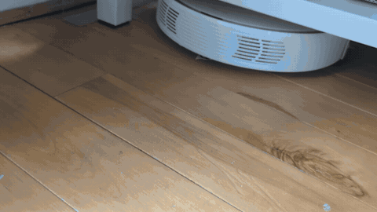

---

## Tech Stack & Capabilities

**Firmware & Control:**
- **Valetudo 2026.02.0** — Open-source local vacuum OS (DustBuilder compiled)
- **SSH Root** — Dropbear with custom legacy crypto flags for modern OpenSSH
- **REST API** — Full Valetudo v2 API (device control, map streaming)
- **MQTT Integration** — Home Assistant MQTT discovery (Mosquitto broker)

**Custom Enhancements:**
- **GLaDOS Voice Pack** — Portal-themed custom robot voice
- **Dual A/B Partitions** — Both system partitions flashed for redundancy & recovery

**Performance:**
- **510MB dual A/B flash:** ~3 minutes (optimized 4MB block writes vs. 66 min with naive 512B blocks)
- **Zero cloud dependency** — All control local, no Xiaomi servers required
- **Instant MQTT response** — No internet connection needed for operation

---

## Hardware

- **Robot:** Roborock S5 (roborock.vacuum.s5, S502-00)
- **SoC:** Allwinner R16 (ARM Cortex-A7, 512MB RAM)
- **Storage:** eMMC with A/B partition scheme
- **UART access:** CP2102 USB-UART adapter → test points TPA8 (TX), TPA15 (RX), TPA16 (GND) on mainboard
- **Baud:** 115200

---

## The Journey

### Phase 1 — Research & Blocked OTA (May 3)

Started with the standard approach: build a rooted firmware on [DustBuilder](https://builder.dontvacuum.me), push OTA via `python-miio`. This would have been 10 minutes.

**Blocker:** Xiaomi cloud OTA locked on this device. The `update_firmware` command was silently rejected. The robot stayed on stock firmware.

**Decision:** Order a CP2102 USB-UART adapter and go physical.

---

### Phase 2 — Physical Access (May 14)

Opening the robot is straightforward — 4 Phillips screws, lift the top shell. The UART test points are exposed on the mainboard near the Allwinner SoC.

**Step 1 — Disassembly**

| | |
|---|---|
| 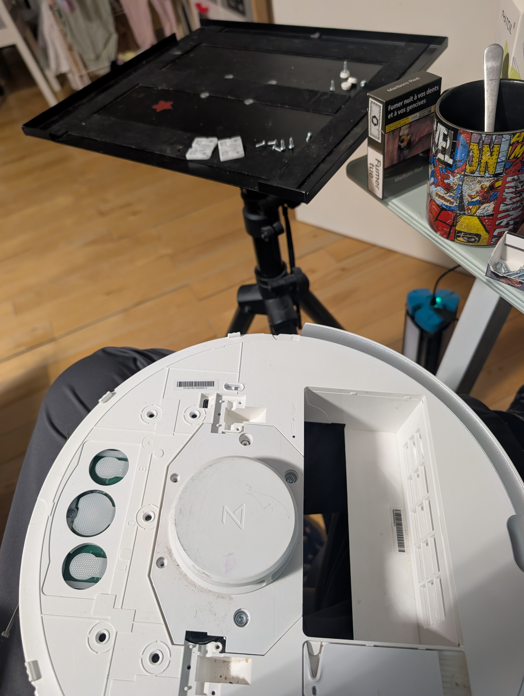 | 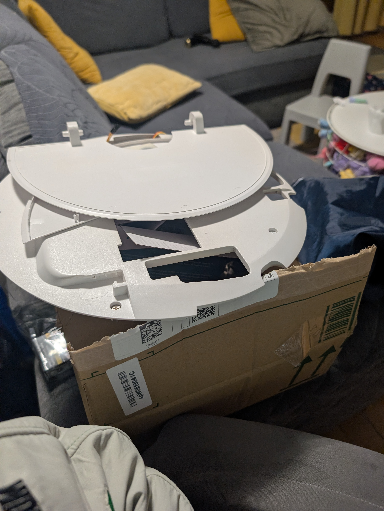 |
| *Bottom panel off — 4 screws, clean access* | *Top shell removed, robot propped upright* |

| | |
|---|---|
| 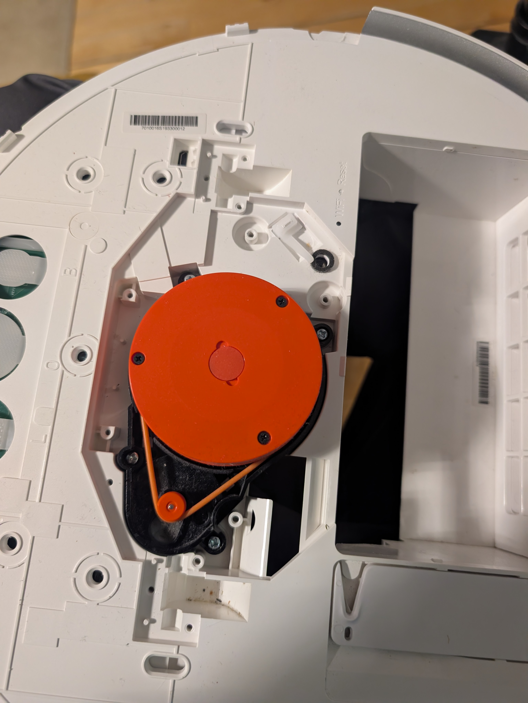 | 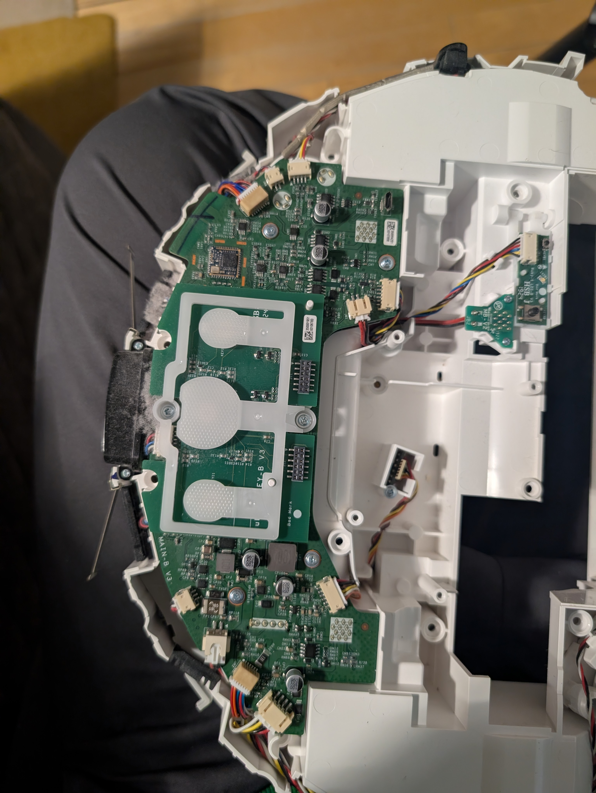 |
| *LiDAR assembly — red motor disc under the top shell* | *Mainboard exposed: MAIN-B V3 with Allwinner R16 SoC* |

**Step 2 — Locating and soldering the UART test points**

The test points are labeled directly on the PCB silkscreen — no guessing required.

| | |
|---|---|
| 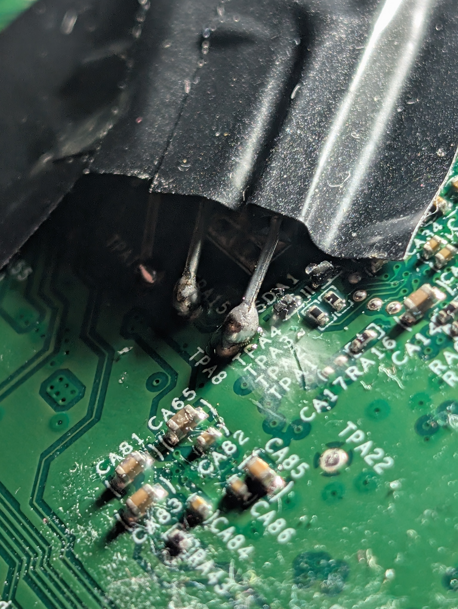 | 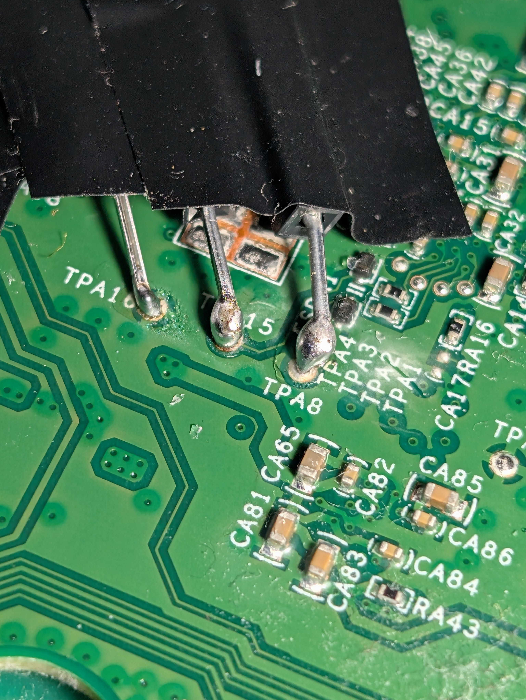 |
| *Wires soldered — TPA8 (TX), TPA15 (RX), TPA16 (GND)* | *PCB silkscreen labels: TPA8, TPA15, TPA16 — no probing needed* |

| | |
|---|---|
| 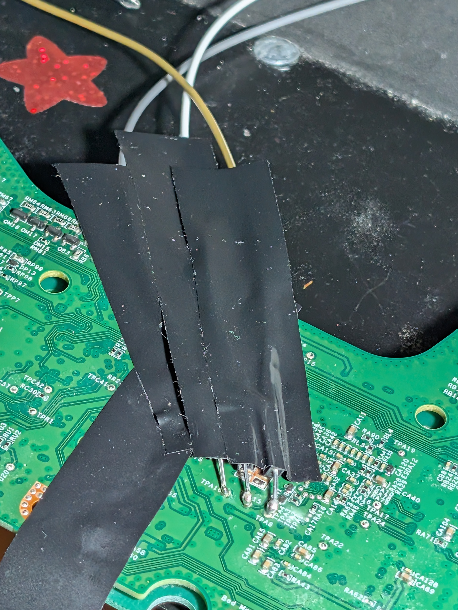 | 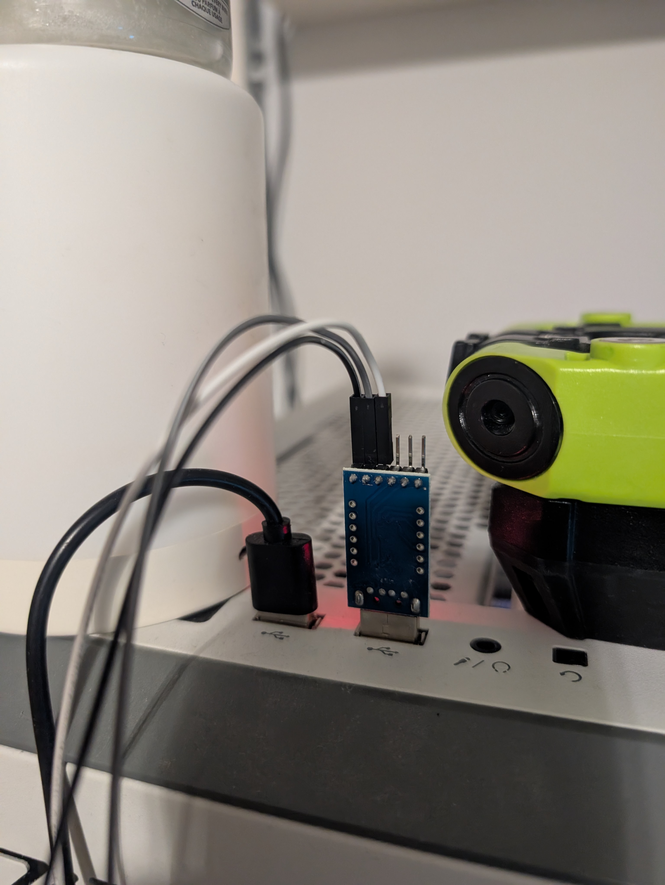 |
| *Black electrical tape — strain relief on solder joints* | *CP2102 adapter plugged into PC — the bridge between robot and terminal* |

**Step 3 — Full workbench setup**

| | |
|---|---|
| 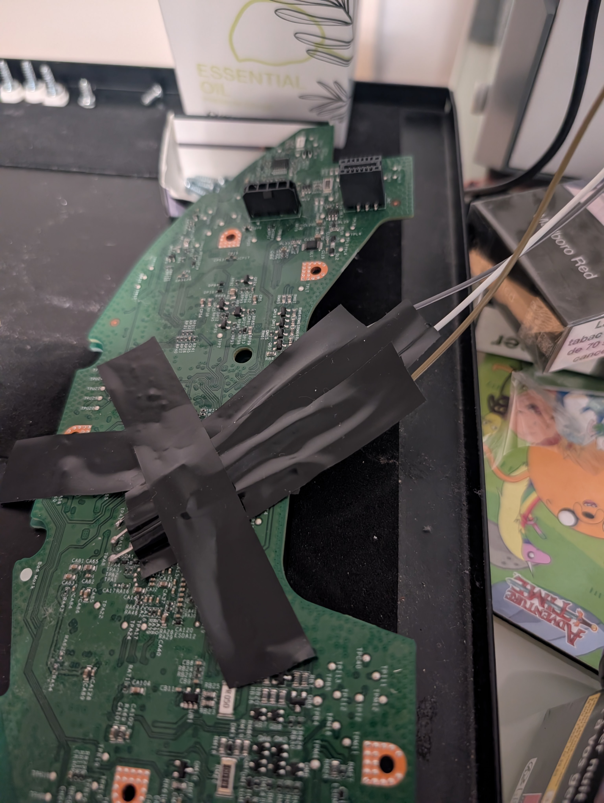 | 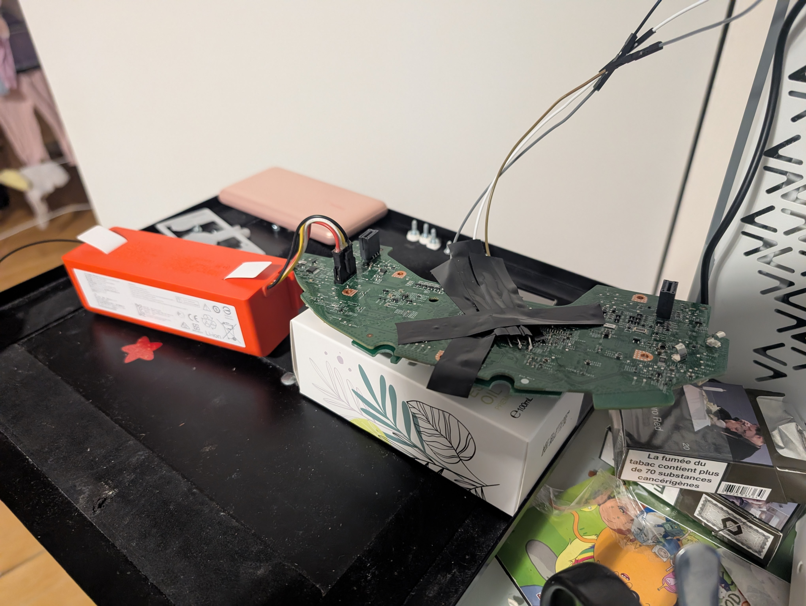 |
| *Mainboard out, UART wires running to CP2102* | *Full setup — battery disconnected, 3 UART wires to PC* |

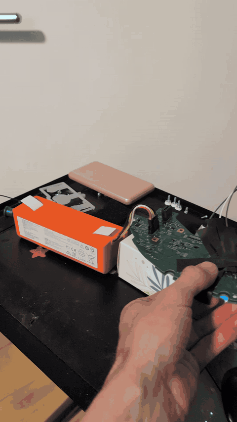

```
CP2102 TX  →  TPA15 (robot RX)
CP2102 RX  →  TPA8  (robot TX)
CP2102 GND →  TPA16 (GND)
```

**PuTTY serial session: 115200 baud.** Boot log visible immediately.

---

### Phase 3 — Catching U-Boot (May 14–15)

The U-Boot window is ~2 seconds. Built two Python automation scripts:

- **`valetudo-flash/catch-uboot.py`** — Monitors UART, automatically sends `s` at the right moment, drops to interactive U-Boot shell.
- **`valetudo-flash/auto-root.py`** — Full automated root: catches U-Boot, patches sshd config, sets root password, enables SSH.

The key insight: U-Boot's `key_detect` on the Allwinner R16 checks for `s` specifically. Other characters (space, enter, ESC) are silently ignored.

| | |
|---|---|
| 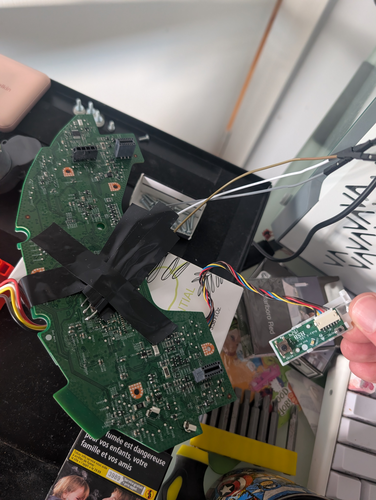 | 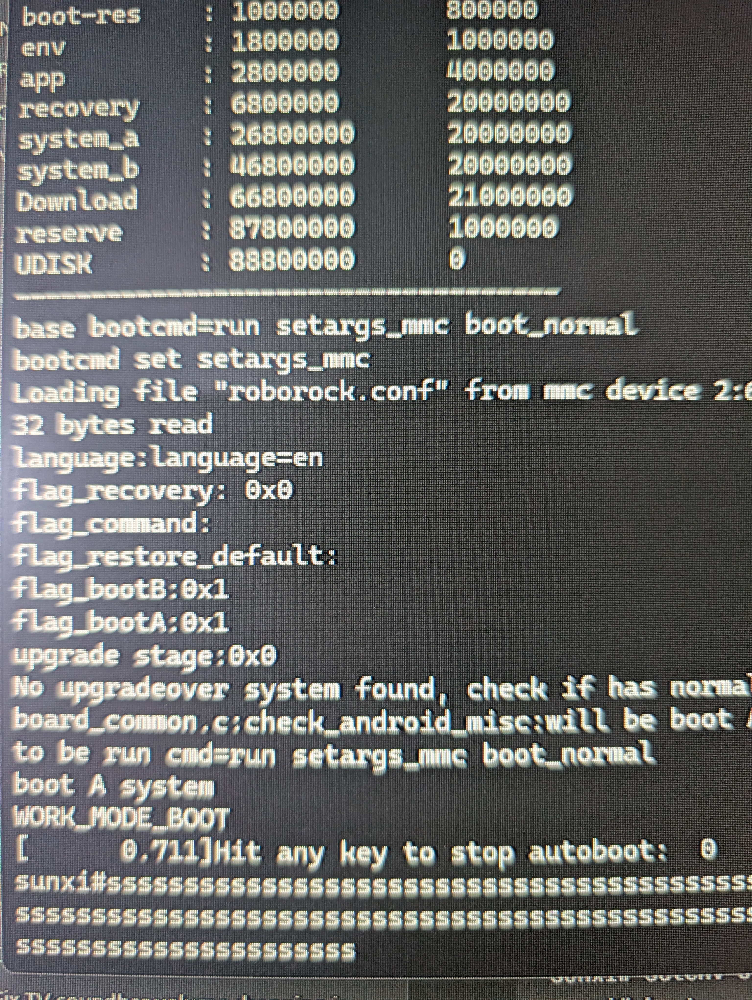 |
| *Reassembling with UART wires still live — catching U-Boot mid-boot* | *`catch-uboot.py` floods `s` — partition table visible, boot intercepted* |

```bash
sunxi# setenv bootargs ${setargs_mmc} init=/bin/sh
sunxi# boot
# Boots straight to a root shell, bypassing init
```

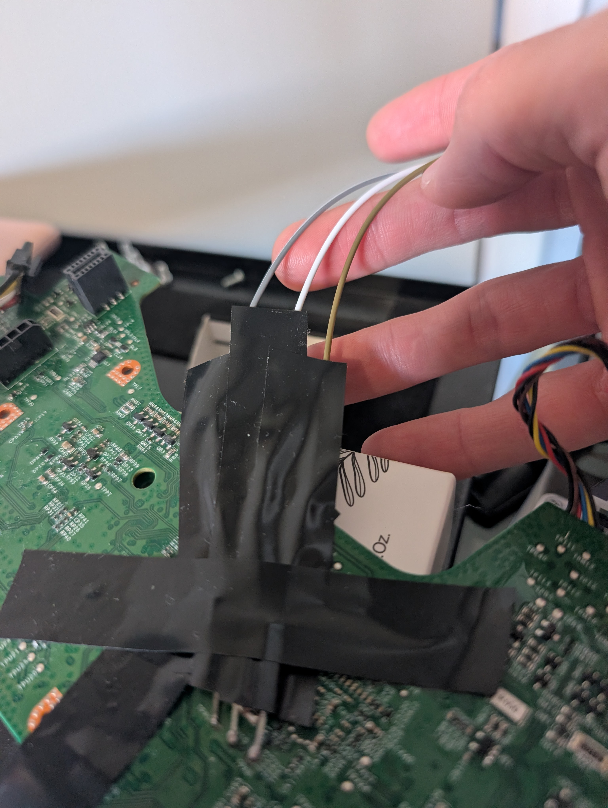

*UART harness exiting the chassis — reassembled enough to boot, open enough to monitor*

---

### Phase 4 — Building the Right Firmware (May 15)

**Blocker #1 — Wrong DustBuilder option.** The first build used "Build update package" → generates a `.pkg` file (Xiaomi OTA format, ccrypt-encrypted, requires the robot's OTA daemon). This cannot be installed manually via SSH.

**Fix:** Use **"Build for manual installation"** instead → generates a `tar.gz` containing:
- `disk.img` — 510MB ext4 rootfs with Valetudo 2026.02.0 baked in
- `install_b.sh` — flashes the inactive partition and sets U-Boot flags
- `install_a.sh` — run after reboot to mirror-flash the other partition
- `firmware.md5sum` — integrity check

**Blocker #2 — SSH incompatibility.** OpenSSH 10 vs Dropbear 2013.60 on stock firmware. Modern OpenSSH refuses legacy algorithms by default.

**Fix:**
```bash
ssh -oKexAlgorithms=+diffie-hellman-group14-sha1 \
    -oHostKeyAlgorithms=+ssh-rsa \
    -oPubkeyAcceptedAlgorithms=+ssh-rsa \
    -oMACs=+hmac-sha1 \
    root@<robot-ip>
```

**Blocker #3 — No wget/curl on stock firmware, BusyBox nc is client-only.** File transfer needed a creative solution.

**Fix:** Python raw TCP server on Windows — robot connects as a client, server streams the file:
```python
import socket
fw = 'roborock.vacuum.s5_2034_fw.tar.gz'
s = socket.socket()
s.bind(('0.0.0.0', 9999))
s.listen(1)
conn, _ = s.accept()
with open(fw, 'rb') as f:
    while chunk := f.read(131072):
        conn.sendall(chunk)
# On robot: nc 192.168.0.10 9999 > /mnt/data/roborock_fw.tar.gz
```

Transfer: 79MB at ~2MB/s over Wi-Fi in 37 seconds.

---

### Phase 5 — Flashing (May 15–16)

The Roborock S5 uses an **A/B partition scheme** on eMMC:

| Partition | Device | Size | Role |
|-----------|--------|------|------|
| system\_a | mmcblk0p8 | 512MB | Active root |
| system\_b | mmcblk0p9 | 512MB | Inactive / standby |
| /mnt/data | mmcblk0p1 | 1.5GB | Persistent data |
| U-Boot env | mmcblk0p5 | 16MB | Boot flags (A/B GOOD/BAD) |

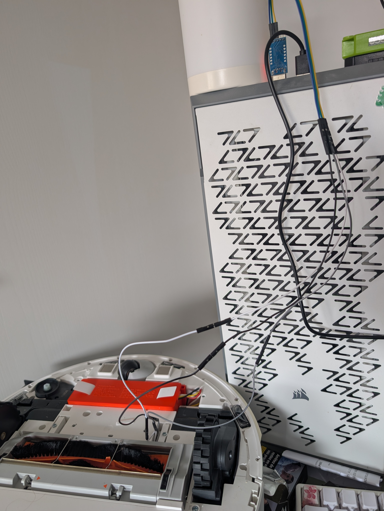

*Flash day — robot open on desk, UART cable running up to the PC*

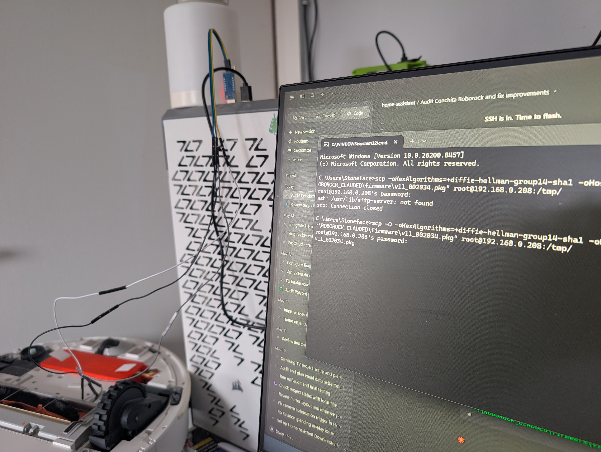

*"SSH is in. Time to flash." — but SCP immediately fails: `ash: /usr/lib/sftp-server: not found`. Dropbear has no sftp-server.*

**Stage 1 — Flash system\_b while running system\_a:**

```bash
# Patch install_b.sh for speed (default dd bs=512 → 22× slower for 510MB)
sed -i 's|dd if=/mnt/data/disk.img of=/dev/mmcblk0p9|& bs=4M|' install_b.sh
sh install_b.sh
# → 534MB written at 11.4 MB/s (~47s)
# → system_b GOOD, system_a BAD → reboot → Valetudo boots on system_b
```

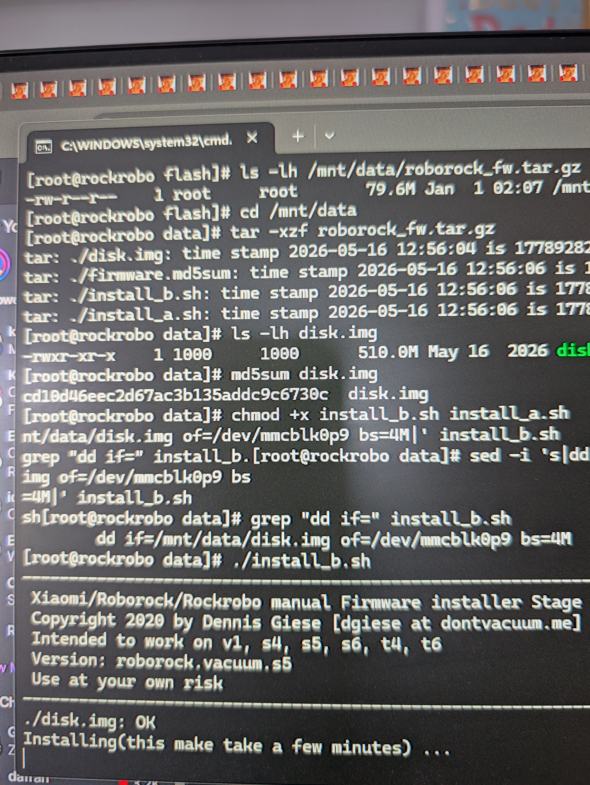

*`install_b.sh` starting — `./disk.img: OK`, writing 510MB to system\_b*

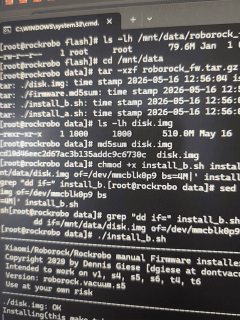

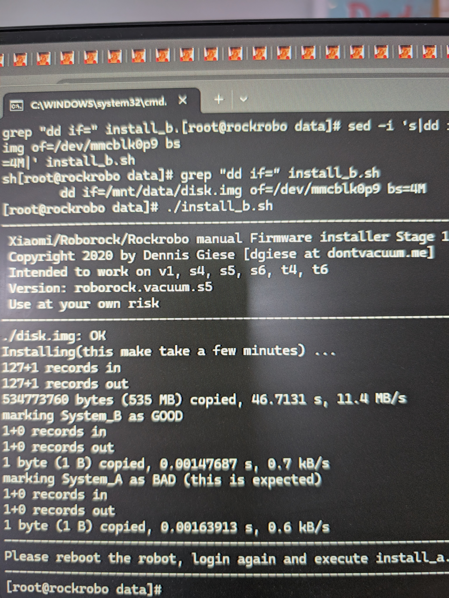

*534,773,760 bytes copied in 46.7s at **11.4 MB/s** — System\_B GOOD, System\_A BAD. Reboot.*

**Stage 2 — Flash system\_a while running Valetudo on system\_b:**

```bash
sh install_a.sh
# → 534MB written to system_a → system_a GOOD
# → disk.img deleted (frees 510MB)
# → reboot → both partitions identical
```

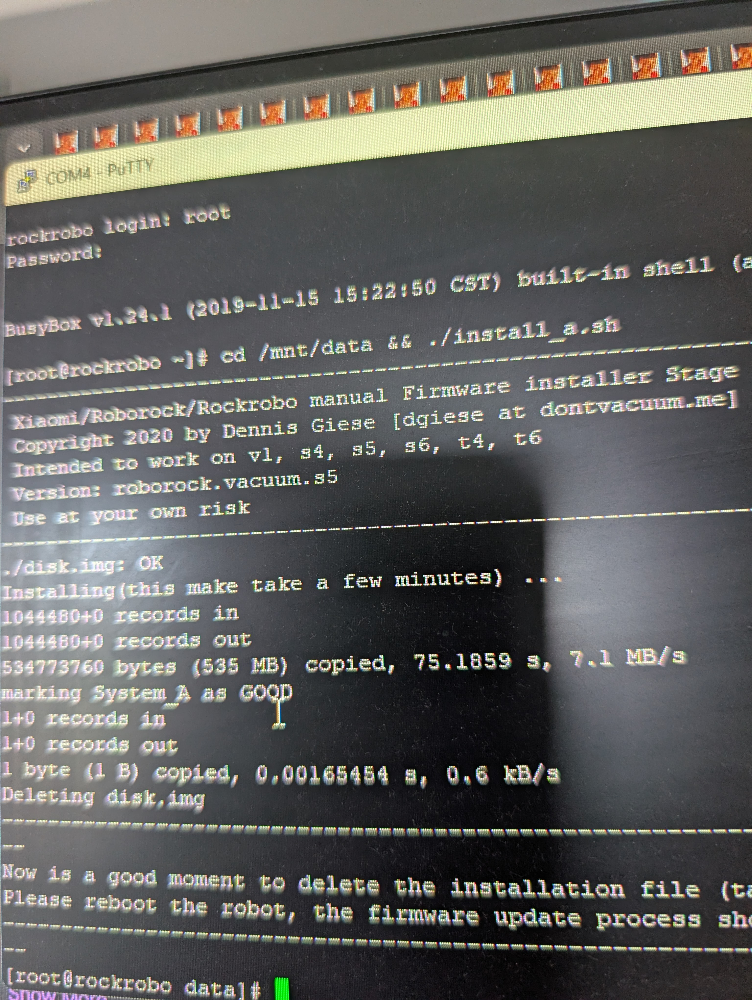

*PuTTY serial session — `install_a.sh` completes: System\_A GOOD, `disk.img` deleted. Both partitions flashed. Done.*

**U-Boot boot flags** (written directly to mmcblk0p5 at byte offsets):
```bash
# Mark system_b GOOD:
echo -n -e '\x1' | dd conv=notrunc of=/dev/mmcblk0p5 bs=1 count=1 seek=311552
# Mark system_a BAD:
echo -n -e '\x4' | dd conv=notrunc of=/dev/mmcblk0p5 bs=1 count=1 seek=309504
```

---

### Phase 6 — Voice Pack (May 16)

Valetudo supports custom voice packs (ccrypt-encrypted tar.gz of WAV files). Getting one installed turned into its own debugging session:

| Attempt | Blocker | Solution |
|---------|---------|----------|
| Valetudo UI → Xiaomi CDN URL | CDN resolves to 203.0.113.1 (blocked on robot) | Transfer locally |
| Python HTTP server on Windows | Windows Firewall blocking inbound port | Add firewall rule |
| `scp` to robot | Dropbear has no sftp-server | — |
| `nc -l` on robot | BusyBox nc is client-only, no listen mode | base64 over SSH pipe |
| `busybox httpd` | Not compiled in this build | — |
| Direct ccrypt decrypt on robot | `ccrypt` **is** present | ✅ This worked |

**Final approach — base64 pipe + ccrypt decrypt:**
```bash
# Transfer 29MB GLaDOS voice pack (Windows Git Bash)
base64 glados_custom_v1.pkg | ssh root@192.168.0.208 \
  "base64 -d > /mnt/data/glados.pkg && md5sum /mnt/data/glados.pkg"

# On robot — decrypt and extract directly to voice directory
ccrypt -d -K "r0ckrobo#23456" /mnt/data/glados.pkg
tar -xzf /mnt/data/glados.pkg -C /opt/rockrobo/resources/sounds/en/
# No restart needed — audio daemon reads WAV files at runtime
```

---

## Architecture Post-Flash

```
┌─────────────────────────────────────────────┐
│           Roborock S5 "Conchita"            │
│                                             │
│  Valetudo 2026.02.0  (web UI :80)          │
│  ├── REST API  /api/v2/...                  │
│  ├── MQTT → broker:1883                    │
│  │   └── vacuum/conchita/#                  │
│  └── Map PNG tile streaming                 │
│                                             │
│  rockrobo daemon (motion, lidar, vacuum)    │
│  SSH root (Dropbear, DustBuilder keypair)  │
└──────────────────┬──────────────────────────┘
                   │ MQTT
┌──────────────────▼──────────────────────────┐
│              Home Assistant                 │
│                                             │
│  Mosquitto MQTT broker :1883               │
│  vacuum.conchita (MQTT discovery entity)   │
│  Automations: dock/clean relay logic       │
└─────────────────────────────────────────────┘
```

---

## Key Lessons

1. **DustBuilder has two modes** — "update package" (OTA, Xiaomi-encrypted) vs "manual installation" (tar.gz + install scripts). Always use manual for UART flash.

2. **OpenSSH 10 + Dropbear 2013 needs legacy flags** — without `-oKexAlgorithms`, `-oHostKeyAlgorithms`, `-oPubkeyAcceptedAlgorithms`, and `-oMACs`, connections fail silently with "no mutual algorithm".

3. **A/B partition requires two-stage flash** — flash inactive partition → reboot → flash the other. Both stages use the same `disk.img` already on the device.

4. **`dd` without `bs=4M` is ~22× slower** — for a 510MB write: 512-byte blocks = ~23 minutes, 4M blocks = ~47 seconds.

5. **No scp/sftp? Use base64 over SSH** — `base64 file | ssh host "base64 -d > /dest"` works anywhere with an SSH connection and BusyBox base64.

6. **BusyBox `nc` is often client-only** — listen mode is not compiled in many embedded builds. Check for `ccrypt`, `python3`, or `socat` as alternatives for local file ops.

---

## Tools Used

| Tool | Purpose |
|------|---------|
| [DustBuilder](https://builder.dontvacuum.me) | Build rooted Valetudo firmware |
| [Valetudo](https://valetudo.cloud) | Open-source local vacuum control |
| CP2102 USB-UART | Serial console access to mainboard |
| PuTTY | UART terminal + SSH client |
| Python 3 (stdlib `socket`) | Raw TCP file transfer server |
| ccrypt | Decrypt/encrypt Roborock voice packs |
| Home Assistant + Mosquitto | Automation platform + MQTT broker |
| [GLaDOS Voice Pack](https://community.home-assistant.io/t/glados-portal-voice-pack-for-roborock-xiaomi-vacuums/241101) | Custom robot voice |

---

## Repository Structure

```
valetudo-flash/
├── catch-uboot.py      # UART monitor — sends 's' at U-Boot key_detect window
├── auto-root.py        # Automated UART root: U-Boot catch + SSH enable + passwd
├── log.txt             # Raw UART boot log from the flash session
└── custom-v1/          # GLaDOS voice pack WAV files (extracted from pkg)

docs/
├── valetudo-research.md    # Pre-flash device assessment and eligibility
├── migration-path.md       # Step-by-step migration checklist (cloud → local)
└── mqtt-contract.md        # HA MQTT entity YAML and topic map

Media/                  # Photos, videos and GIFs of the physical operation
```

---

## References

- [Valetudo documentation](https://valetudo.cloud/pages/general/getting-started.html)
- [DustBuilder](https://builder.dontvacuum.me) — Dennis Giese
- [dontvacuum.me](https://dontvacuum.me) — Roborock internals research
- [therealmoeder.github.io](https://therealmoeder.github.io/rockrobo.html) — Community voice pack archive
- [valetudo-helper-voicepacks](https://github.com/Hypfer/valetudo-helper-voicepacks) — Build custom voice packs

---

*Part of a larger Home Assistant local-first infrastructure project.*
